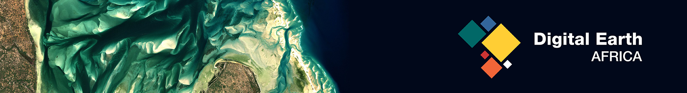

# Digital Earth Africa's Continental Standardised NDVI Anomalies

## Background

Standardised NDVI Anomalies provide a measure of vegetation health relative to long term average conditions by measuring the departure, in units of standard devaiations, away from the long-term average. These indices can be used to monitor areas where vegetation may be stressed, and as a proxy to detect potential drought. Negative values represent a reduction from normal NDVI, while positive values represent an increase from normal.

## Description

The Standardized NDVI Anomaly will have the following specifications:

* [NDVI climatologies](https://docs.digitalearthafrica.org/en/latest/data_specs/NDVI_Climatology_specs.html) are developed using harmonized Landsat 5,7,and 8 satellite imagery from the years 1984 to 2020
* Anomalies will have monthly temporal frequency and include images from Landsat 8, Landsat 9, and Sentinel-2
* All datasets will have a native spatial resolution of 30 metres

## Updating the pip requirements

Fix any requirement versions in `docker/fixed-requirements.txt`

Install `pip-tools` and then run `pip-compile --output-file=docker/requirements.txt production/ndvi_tools/setup.py docker/fixed-requirements.txt`.

## Testing notes

Using the dev Sandbox, so that we have a full index of datasets, clone the NDVI repo
and then install using pip `pip install --editable ndvi-anomalies/production/ndvi_tools`.

Dump out a DB for a single month:

`odc-stats save-tasks --temporal-range=2021-08--P1M --grid=africa_30 --usgs-collection-category=T1 ls8_sr-ls9_sr-s2_l2a`

Run one tile:

`odc-stats run --config=production/ndvi_tools/config/ndvi_anomaly.yaml --location=file:///home/jovyan/ndvi ls8_sr-ls9_sr-s2_l2a_2021-08--P1M.db 2021-08--P1M/178/088`

## Additional information

**License:** The code in this notebook is licensed under the [Apache License, Version 2.0](https://www.apache.org/licenses/LICENSE-2.0).
Digital Earth Africa data is licensed under the [Creative Commons by Attribution 4.0](https://creativecommons.org/licenses/by/4.0/) license.

**Contact:** If you need assistance, please post a question on the [Open Data Cube Slack channel](http://slack.opendatacube.org/) or on the [GIS Stack Exchange](https://gis.stackexchange.com/questions/ask?tags=open-data-cube) using the `open-data-cube` tag (you can view previously asked questions [here](https://gis.stackexchange.com/questions/tagged/open-data-cube)).
If you would like to report an issue with this notebook, you can file one on [Github](https://github.com/digitalearthafrica/crop-mask/issues).
