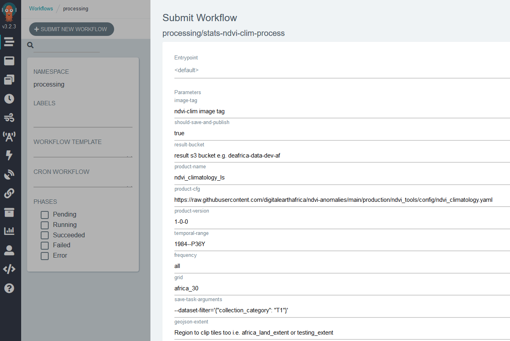
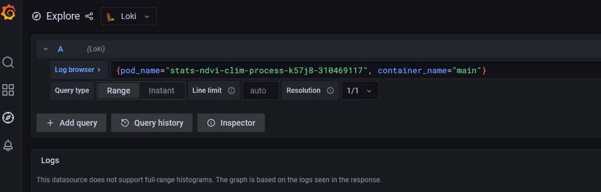

# Continental NDVI Anomalies - Production

The code base here provides all the methods necessary for running the NDVI anomalies pipeline using AWS's Kubernetes platform. The methods rely on the Open Data Cube's [Statistician](https://github.com/opendatacube/odc-stats) library for orchestrating the computation on AWS's cloud infrastructure. Argo is used for deploying the code on kubernetes. Argo is a tool that simplifies orchestrating parallel jobs on kubernetes.

## How to build and install the `ndvi_tools` library

In the folder `ndvi_tools/`, run the following shell command:

```bash
pip install ndvi_tools

```

---

**The NDVI anomalies production is divided into two stages.  The first stage is calculation of long-term NDVI mean and standard deviation 'climatologies'.**

## Stage 1: NDVI Climatologies

### Local testing of the plugin

The ODC-statistician plugin that calculates the NDVI climatolgies can be tested within DE Africa's Sandbox environment using the notebook [1_Plugin_testing.ipynb](1_Plugin_testing.ipynb).

* The ODC-stats plugin for calculating the NDVI climatologies is called: [ndvi_climatology_plugin](ndvi_tools/ndvi_tools/ndvi_climatology_plugin.py)
* A yaml is required to configure the plugin: [ndvi_climatology](ndvi_tools/ndvi_tools/config/ndvi_climatology.yaml)

### Running production code
 
 > Note, the following contains an example of running the code on the DEV EKS.
 
        DEV Cluster: deafrica-dev-eks
        PROD Cluster: deafrica-prod-af-eks
 
1. Ensure the `ndvi_climatology` yaml is correct.

2. Ensure the [Dockerfile](../Dockerfile) contains all the right files and libraries. If you alter the `Dockerfile` or the `ndvi_tools` code base you need to rebuild the image, this can triggered by changing the version number [here](../docker/version.txt) and creating a pull request.

3. Login to DE Africa's [Argo-production](https://argo.digitalearth.africa/workflows?limit=500) workspace (or [Argo-dev](https://argo.dev.digitalearth.africa/workflows?limit=500)), click on `submit workflow`, and use the drop-down box to select the `stats-ndvi-clim-process` template.  The yaml file which creates this workflow is located [here](https://github.com/digitalearthafrica/datakube-apps/blob/main/workspaces/deafrica-dev/processing/argo/workflow-templates/stats-ndvi-clim.yaml) in the [datakube-apps](https://github.com/digitalearthafrica/datakube-apps) repo.

4. Change the parameters in the workflow template to align with the job you're running. A screen shot is shown below.

    * The `image-tag` number is the version number of the docker image i.e. the number [here](https://github.com/digitalearthafrica/ndvi-anomalies/blob/main/docker/version.txt)
    * The `result-bucket` is the location where the output geotiffs will be stored. This is `deafrica-services` if running the full production run, `deafrica-data-staging-af` if testing in production workspace, and `deafrica-data-dev-af` if running in the dev environment.
    * The `product-name` is "ndvi_climatology_ls" 
    * The `product-cfg` is the _raw_ github https link to the plugin configuration yaml, i.e. this file [here](https://raw.githubusercontent.com/digitalearthafrica/ndvi-anomalies/main/production/ndvi_tools/config/ndvi_climatology.yaml)
    * `product-version` is usually just `1-0-0`, unless re-running the product with an updated version.
    * `temporal-range` is the time range that gets passed to `odc-stats save tasks`; for the NDVi climatology this will _always_ be `1984--P36Y`.
    * `geojson-extent` defines a region of tiles to run. There are only two option: either "testing_extent" which covers 110 tiles covering a region from Ghana to Tunisia, use this extent if running a large scale test.  The other option is "africa_land_extent" which will run all tiles over the land mass of Africa (ocean tiles are excluded).
    * `parallel-processing` refers to the number of pods K8s will scale too. For testing, set this to `1` and a single machine will run - this makes it easy to inspect logs etc.  For the full scale production runs a good number is `100` (100 machines will run 100 tiles in parallel).
    * The other parameters (`input-products`, `queue`, `resolution` etc.) should mostly stay as their defaults.
    * Hit the `submit` button when you're happy with the inputs and the code will be deployed.
    
    


5. To monitor the batch run you can use:
   
     * Production CPU, memory, SQS monitoring: 
     * Dev CPU, memory, SQS monitoring: https://mgmt.dev.digitalearth.africa/d/NDVIClimAnomalies/landsat-ndvi-anomalies

6. To check the logs of any pod, you can click on one of the pods that displays in Argo after you hit submit and then click the `logs` button. For more detailed logs, within the grafana dashboard linked above navigate to the 'explore --> Loki' tab and enter a pod-name in the query as per the example in the screenshot below. 




### Other useful run notes

The following commands can only be run in a devbox. To connect your devbox to the cluster run:
         
         setup_aws_vault deafrica-dev-eks
         ap deafrica-dev-eks
         
The dev and prod cluster are called:  **DEV Cluster:** `deafrica-dev-eks`, **PROD Cluster:** `deafrica-prod-af-eks`


* To list tiles in a s3 bucket; useful to know if results have been successfully written to disk
        
        aws s3 ls s3://deafrica-data-dev-af/ndvi_climatology_ls/
        
* To sync (copy) results in a s3 bucket to your local machine
        
        aws s3 sync s3://deafrica-data-dev-af/ndvi_climatology_ls/ ndvi_climatology_ls
        

* If doing test runs, and you wish delete test geotifs from the dev bucket
        
        aws s3 rm --recursive s3://deafrica-data-dev-af/ndvi_climatology_ls --dryrun

---
## Stage 2: NDVI Anomalies

This analysis has not been written yet

---

## Additional information

**License:** The code in this notebook is licensed under the [Apache License, Version 2.0](https://www.apache.org/licenses/LICENSE-2.0).
Digital Earth Africa data is licensed under the [Creative Commons by Attribution 4.0](https://creativecommons.org/licenses/by/4.0/) license.

**Contact:** If you need assistance, please post a question on the [Open Data Cube Slack channel](http://slack.opendatacube.org/) or on the [GIS Stack Exchange](https://gis.stackexchange.com/questions/ask?tags=open-data-cube) using the `open-data-cube` tag (you can view previously asked questions [here](https://gis.stackexchange.com/questions/tagged/open-data-cube)).
If you would like to report an issue with this notebook, you can file one on [Github](https://github.com/digitalearthafrica/crop-mask/issues).

